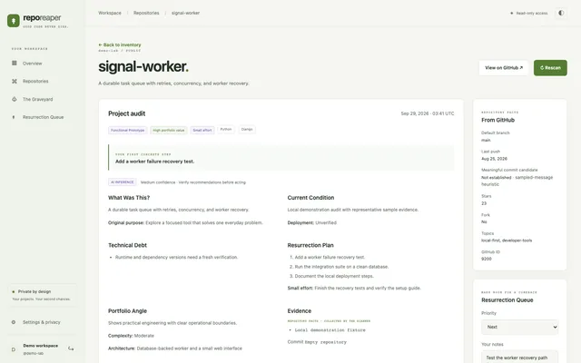

# 💀 Repo Reaper

> **Your GitHub is full of corpses. Let’s see which ones are worth resurrecting.**

Repo Reaper digs through your GitHub history, exhumes forgotten projects, and figures out which ones deserve another shot at life.

Connect GitHub, scan your repositories, and get a high-level view of what you've built, what's rotting, what needs a little work, and what should probably be left in the ground.

Because somewhere between **“weekend experiment”** and **“I'll finish this later”**, things got out of hand.

---

## 📸 Screenshots

Click a screenshot to view it at full size.

<p align="center">
  <a href="docs/screenshots/project-landscape.webp">
    
  </a>
</p>

<p align="center">
  <a href="docs/screenshots/repository-graveyard.webp">
    
  </a>
</p>

<p align="center">
  <a href="docs/screenshots/project-audit.webp">
    
  </a>
</p>

<p align="center">
  <a href="docs/screenshots/resurrection-queue.webp">
    
  </a>
</p>

---

## ⚰️ Welcome to the Graveyard

Developers accumulate repositories.

A lot of repositories.

Some are abandoned prototypes.  
Some are 80% finished.  
Some just need their dependencies updated.  
Some contain genuinely good ideas buried under five years of technical debt.

And some...

...need to stay dead.

**Repo Reaper helps tell the difference.**

Instead of manually digging through dozens—or hundreds—of repositories, Repo Reaper analyzes your GitHub portfolio and turns the mess into something actionable.

---

## 🔥 What Repo Reaper Does

### 🪦 Repository Graveyard

Connect your GitHub account and get a centralized view of your repositories and their current condition.

Quickly surface things like:

- abandoned projects
- recently active projects
- unfinished experiments
- aging technology
- missing documentation
- stale dependencies
- incomplete applications
- projects with resurrection potential

Your GitHub graveyard finally has a map.

---

### 🧠 AI-Assisted Repository Analysis

Repo Reaper doesn't just ask:

> When was this repository last updated?

It tries to answer:

> **Is this thing actually worth working on again?**

Repository analysis can surface signals around:

- project purpose
- completeness
- codebase condition
- maintainability
- documentation quality
- technical debt
- modernization opportunities
- dependency health
- project momentum
- remaining work

The result is a much better answer than:

**“Last commit: 4 years ago.”**

---

### 🧟 Resurrection Candidates

Some dead projects aren't dead.

They're sleeping.

Repo Reaper identifies repositories that appear close enough to useful, interesting enough to revisit, or valuable enough to justify another round of development.

Think:

```text
PROJECT: old-dashboard
STATUS: ☠️ Dormant
CONDITION: Surprisingly intact

Resurrection Potential: HIGH

Suggested revival:
  1. Upgrade dependencies
  2. Repair authentication
  3. Clean up deployment config
  4. Add missing documentation
  5. Ship the damn thing
```

---

### ⚡ Resurrection Queue

Found something worth saving?

Throw it into the **Resurrection Queue**.

Instead of staring at 87 repositories wondering what to work on, build a shortlist of projects actually worth your time.

```text
THE RESURRECTION QUEUE

01  █████████░  Shipwreck
02  ████████░░  Old Portfolio
03  ███████░░░  Music Visualizer
04  █████░░░░░  Random API Thing

NEXT SACRIFICE → ???
```

---

### 🪦 LET IT DIE

Not every project deserves a redemption arc.

Some repositories are:

- obsolete
- redundant
- fundamentally unfinished
- based on ideas you no longer care about
- more expensive to repair than rebuild
- held together by dependencies last updated during the Obama administration

Repo Reaper gives those projects the dignity they deserve.

```text
┌─────────────────────────────────────┐
│                                     │
│             LET IT DIE              │
│                                     │
│   There is nothing left to save.    │
│                                     │
└─────────────────────────────────────┘
```

Closure is a feature.

---

## 🔍 The Reaping Process

```text
               ┌──────────────┐
               │    GitHub    │
               └──────┬───────┘
                      │
                      ▼
              ┌───────────────┐
              │  Repo Reaper  │
              └───────┬───────┘
                      │
          ┌───────────┼───────────┐
          ▼           ▼           ▼
      Repository   Project      Technical
       Signals     Context        Health
          │           │           │
          └───────────┼───────────┘
                      ▼
               AI-Assisted
                 Analysis
                      │
        ┌─────────────┼─────────────┐
        ▼             ▼             ▼
     RESURRECT      REPAIR       LET IT DIE
```

Repo Reaper combines repository metadata and codebase signals to build a clearer picture of each project's condition.

---

## 🩻 What Gets Examined?

Depending on the repository, Repo Reaper can evaluate signals such as:

| Signal                  | Why it matters                                       |
| ----------------------- | ---------------------------------------------------- |
| 🕒 Last Activity        | How long the project has been dormant                |
| 🧱 Project Structure    | Whether there's a real application hiding in there   |
| 📦 Dependencies         | How much modernization may be required               |
| 📚 Documentation        | Whether future-you left present-you any instructions |
| 🧪 Project Completeness | Prototype, partial build, or nearly shippable        |
| 🛠️ Maintenance Burden   | How painful resurrection could become                |
| 🧠 Project Purpose      | What the hell this thing was supposed to do          |
| 🚀 Revival Potential    | Whether additional effort may actually be worthwhile |

Individual signals aren't the verdict.

The goal is to combine them into enough context to make the repository understandable again.

---

## 👻 Built for Project Archaeology

Repo Reaper is especially useful if you:

- build a ridiculous number of side projects
- frequently prototype new ideas
- have years of abandoned GitHub repositories
- can't remember what half your repos do
- want to clean up your public GitHub
- want to find forgotten portfolio projects
- keep saying **“I should finish that someday”**
- enjoy discovering code written by a mysterious developer who somehow has your name

That mysterious developer was you.

Three years ago.

At 2:14 AM.

---

## 🔐 GitHub Access

Repo Reaper uses GitHub authentication to analyze repositories associated with your account.

The application is designed around **read-only repository analysis**.

It does not need to start rewriting your projects, force-pushing branches, or wandering around your GitHub account with a loaded shotgun.

Your repositories remain yours.

Repo Reaper is there to inspect the graveyard—not vandalize it.

---

## 📊 Scan History

Projects change.

Repo Reaper can preserve scan results so repository health isn't just a single snapshot.

That opens the door to tracking things like:

```text
SCAN #12

Technical Debt        ███████░░░
Documentation         ████████░░
Completeness          █████████░
Resurrection Score    █████████░

↑ +18% since previous scan

THE CORPSE IS MOVING.
```

Seeing a project improve is much more useful than repeatedly analyzing it from scratch.

---

## 🎯 The Goal

Repo Reaper isn't trying to generate another GitHub dashboard full of stars, forks, and contribution counts.

GitHub already does that.

The question Repo Reaper cares about is different:

> **Out of everything I've ever built, what deserves my attention now?**

That's the entire idea.

Turn years of abandoned experiments into a searchable, understandable project inventory—and occasionally discover that something you thought was dead is actually one good weekend away from shipping.

---

## 🧪 Project Status

Repo Reaper is actively evolving.

Current areas of focus include:

- deeper repository analysis
- better resurrection recommendations
- repository health history
- scan-to-scan comparisons
- modernization detection
- dependency and runtime analysis
- stronger project categorization
- richer portfolio-level insights
- better explanations for _why_ a project received its assessment

And, naturally:

**more elaborate methods of determining whether your terrible 2019 side project deserves another chance.**

---

## 🗺️ Future Ideas

Some things lurking deeper in the graveyard:

- **Dependency Graveyard** — surface ancient and dangerous dependencies across projects
- **Project Necromancer** — generate actionable resurrection plans
- **Portfolio Health** — analyze an entire GitHub account as one engineering portfolio
- **Project Similarity** — discover three repositories that were secretly attempts at building the same thing
- **Resurrection Tracking** — watch projects move from abandoned → repaired → shipped
- **Automated Cleanup Suggestions** — identify projects that could be archived with confidence
- **Historical Diffing** — show exactly how a repository's health changed between scans

The graveyard can always get deeper.

---

## 🤝 Contributing

Found a bug?

Have an idea?

Think Repo Reaper incorrectly sentenced one of your beautiful creations to eternal damnation?

Open an issue or submit a pull request.

Contributions, feature ideas, weird repository edge cases, and sufficiently tasteful graveyard jokes are welcome.

---

## ⚠️ Disclaimer

Repo Reaper provides analysis and recommendations based on the information available in a repository.

It cannot determine whether your abandoned side project will become a billion-dollar startup.

Unfortunately.

---

## 💀 Final Words

Every developer eventually builds a graveyard.

Repo Reaper just turns on the lights.

```text
$ repo-reaper

Scanning graveyard...

47 repositories found.
19 dormant.
11 questionable.
6 promising.
3 should never have existed.

Resurrection candidates located.

LET'S DIG.
```

**Dig up the past. Find what's worth saving. Ship something.**
