## Application-Specific Context

This copy of the ecosystem documentation belongs to **Repo Reaper**.

Its primary ecosystem role is:

> GitHub repository analyzer and cleanup assistant

Primary integrations:

> GitHub, Black Box, House Edge, README Roulette

# Rippley Labs Ecosystem

> The detailed architecture map for Rippley Labs.
>
> Update this document whenever an application's name, responsibility, data
> ownership, integration, or deployment changes.

## System Overview

Rippley Labs is a collection of independently useful applications connected by
three central products:

- **Shipwreck:** discovery, navigation, and launching
- **Black Box:** events, workflows, and cross-app orchestration
- **House Edge:** analytics, telemetry, and reporting

Applications remain independently deployable and retain ownership of their
domain data.

## Architecture Diagram

```mermaid
flowchart TB
    User([User])

    Shipwreck["Shipwreck<br/>Portal & Launcher"]
    BlackBox["Black Box<br/>Integration & Orchestration"]
    HouseEdge["House Edge<br/>Analytics Platform"]

    subgraph Productivity["Productivity & Work"]
        Deck["Deck"]
        RunningTab["Running Tab"]
        Shuffle["Shuffle"]
    end

    subgraph DeveloperTools["Developer Tools"]
        RepoReaper["Repo Reaper"]
        PortAuthority["Port Authority"]
        EnvReaper["Env Reaper"]
        PitBoss["Pit Boss"]
    end

    subgraph ContentUtilities["Content, AI & Utilities"]
        ReadmeRoulette["README Roulette"]
        SaveScum["Save Scum"]
        StackedDeck["Stacked Deck"]
        Diffusion["Diffusion"]
    end

    subgraph LearningGames["Learning & Games"]
        AlgebraQuest["Questbook / Algebra Quest"]
        SudoSurvive["Sudo Survive"]
    end

    User --> Shipwreck

    Shipwreck --> Deck
    Shipwreck --> RunningTab
    Shipwreck -. planned discovery link .-> Shuffle
    Shipwreck --> RepoReaper
    Shipwreck --> PortAuthority
    Shipwreck --> EnvReaper
    Shipwreck --> PitBoss
    Shipwreck --> ReadmeRoulette
    Shipwreck --> SaveScum
    Shipwreck --> StackedDeck
    Shipwreck --> Diffusion
    Shipwreck --> AlgebraQuest
    Shipwreck --> SudoSurvive

    Deck -- project and task context --> RunningTab
    RepoReaper -- repository findings --> ReadmeRoulette
    PortAuthority -- process status --> PitBoss
    EnvReaper -- environment profiles --> PitBoss

    Deck -- events and commands --> BlackBox
    RunningTab -- events and commands --> BlackBox
    RepoReaper -- events and commands --> BlackBox
    PortAuthority -- events and commands --> BlackBox
    EnvReaper -- events and commands --> BlackBox
    PitBoss -- events and commands --> BlackBox
    ReadmeRoulette -- events and commands --> BlackBox
    SaveScum -- events and commands --> BlackBox
    StackedDeck -- events and commands --> BlackBox
    Diffusion -- events and commands --> BlackBox
    AlgebraQuest -- events and commands --> BlackBox
    SudoSurvive -- events and commands --> BlackBox

    Deck -. telemetry .-> HouseEdge
    RunningTab -. telemetry .-> HouseEdge
    RepoReaper -. telemetry .-> HouseEdge
    PortAuthority -. telemetry .-> HouseEdge
    EnvReaper -. telemetry .-> HouseEdge
    PitBoss -. telemetry .-> HouseEdge
    ReadmeRoulette -. telemetry .-> HouseEdge
    SaveScum -. telemetry .-> HouseEdge
    StackedDeck -. telemetry .-> HouseEdge
    Diffusion -. telemetry .-> HouseEdge
    AlgebraQuest -. telemetry .-> HouseEdge
    SudoSurvive -. telemetry .-> HouseEdge

    BlackBox -. workflow metrics .-> HouseEdge
    Shipwreck -. navigation metrics .-> HouseEdge


```

## Integration Principles

1. Each application owns its domain data.
2. Black Box coordinates work but does not become the universal database.
3. House Edge stores telemetry, not source-of-truth business records.
4. Shipwreck launches products but does not absorb their business logic.
5. Cross-app communication uses APIs, events, commands, and webhooks.
6. Events and public APIs are versioned.
7. Optional integration failures must not corrupt source data.
8. Secrets never travel inside events.
9. Every cross-app request should have a correlation ID.
10. Applications should continue providing core functionality when optional shared services are unavailable.

---

## Known Direct Relationships

| Source          | Target          | Relationship                                             |
| --------------- | --------------- | -------------------------------------------------------- |
| Shipwreck       | Every product   | Discovery, navigation, and launching                     |
| Every product   | House Edge      | Usage, product, revenue, or operational events           |
| Every product   | Black Box       | Domain events, commands, workflows, and automation       |
| Deck            | Running Tab     | Project and task context for time entries                |
| Repo Reaper     | README Roulette | Repository metadata, findings, and recommendations       |
| Port Authority  | Pit Boss        | Running-process and port state                           |
| Env Reaper      | Pit Boss        | Selected environment profiles                            |
| Running Tab     | Stripe          | Payments, saved methods, subscriptions, and invoices     |
| Repo Reaper     | GitHub          | Repository metadata and analysis                         |
| README Roulette | GitHub          | Repository documentation inputs and outputs              |
| Stacked Deck    | AI provider     | Image scanning, identification, and valuation assistance |
| Shuffle         | Plaid           | Optional recurring-transaction candidates; explicit subscription confirmation required |
| Shuffle         | TMDB / JustWatch | Optional regional content mappings; unknown season and plan restrictions stay explicit |
| Shuffle         | OpenRouter / Anthropic | Optional encrypted BYOK or operator-entitled managed AI; proposals only |

---

## Shared Service Boundaries

### Authentication

Shared identity may be used, but individual applications remain responsible for authorization within their own domain.

### Payments

Stripe-related payment state should be synchronized through explicit webhook handling.

Do not treat browser redirects as proof of payment.

### Analytics

Products should emit stable event names and avoid sending sensitive content.

Rippley Labs forwards its existing browser analytics through a Cloudflare Worker on
the same-origin analytics route. The Worker adds approximate network geography from
`request.cf`, using the optional server-only `location.version=1` House Edge contract.
It preserves event/session identities; House Edge owns the structured geography,
retention, geographic aggregation and clustered map. Raw IP is transient, with only
an optional keyed hash retained. GPS is never requested. The Azure/local relay works
without geography when Cloudflare metadata is unavailable. Deploy House Edge's
additive migration 004 and collector before enabling the website Worker.

### AI

AI-powered features should support configured providers or bring-your-own-key access where the product requires it.

Model output must be treated as untrusted input and validated before it changes persistent records.

### Deployment

Products may use Azure, Cloudflare, static hosting, desktop packaging, or local execution depending on their actual requirements.

Do not force every product into the same deployment model.

---

## Architecture Decisions

Document major decisions below.

### ADR-001: Applications Retain Domain Ownership

**Decision:** Each application remains the source of truth for its own domain.

**Reason:** This prevents Black Box, Shipwreck, or House Edge from becoming a fragile central monolith.

### ADR-002: Black Box Is the Orchestration Boundary

**Decision:** Cross-app workflows pass through explicit Black Box contracts where orchestration is required.

**Reason:** This prevents applications from accumulating undocumented direct dependencies.

### ADR-003: House Edge Receives Analytics Events

**Decision:** Applications publish product and operational telemetry to House Edge using versioned events.

**Reason:** Metrics can evolve independently from application databases.

---

### ADR-004: Questbook Generalizes Algebra Quest

**Decision:** Questbook is the working name for the subject-agnostic learning platform. Algebra Quest remains its flagship Algebra I campaign.

**Ownership:** Private browser-local Questbooks, subjects, courses, units, skills, questions, quests, homework images, attempts, mastery, XP transactions, badges and records belong to Questbook. The original Algebra campaign save remains compatible.

**Integration:** Existing House Edge project identity remains `algebra-quest`; no new Black Box event contract or shared database is introduced. Printed-text OCR runs locally using self-hosted assets. An optional user-configured HTTPS provider can extract richer content or generate practice only through explicit user actions, with runtime validation and mandatory review. No public sharing or cloud identity is required.

### ADR-005: Questbook AI Practice Remains Optional

**Decision:** Basic Quest Scan and local learning remain free. AI Practice Generator is available through a tested, memory-only BYOK session or an authorized Questbook Pro account. Structured questions and cached learning context drive generation; homework images are not resent for practice.

**Ownership:** Original questions remain separate from generated Practice Packs. Questbook owns provenance, verification state, private feedback, generation history and usage accounting. Generated content uses the existing universal question model and reward engine; deterministic mathematical answers are independently checked, with separate AI review for other content.

**Deployment and security:** The frontend stays a static export. An optional Azure Static Web Apps managed function authorizes Pro through the trusted authenticated identity and `questbook_pro` role. Hosted provider secrets remain server-side. A private Questbook-owned Azure Storage Table atomically enforces configurable monthly request limits and stores content-free usage records. Local/BYOK use requires no cloud login. Billing/role provisioning is operator-configured, not inferred from client state. No House Edge or Black Box integration contract changes.

### ADR-006: Questbook Relationships Require Student Acceptance

**Decision:** Optional signed-in student, parent and teacher accounts add parent–student, teacher–student and student friendship relationships. Students explicitly accept invitations before monitoring or comparisons are allowed. Either participant can revoke a connection; reconnecting requires fresh consent.

**Ownership:** Questbook owns cloud account profiles, single-use hashed invitations, accepted relationships, opt-in shared progress summaries and friend challenge results in a private Questbook Azure Storage Table. Browser-local learning saves, authored content and homework remain local; publishing summaries does not merge or synchronize learning saves across devices.

**Deployment and security:** The existing static frontend and optional SWA managed API architecture remain. SWA supplies authenticated provider identity; server-side relationship checks restrict access. Parents and teachers can read shared aggregate progress and skill mastery; friends can read aggregate totals and enter mutually accepted, server-graded Algebra challenge quests. Revocable device permissions control automatic summary publishing. Accounts and challenges do not require Pro. House Edge and Black Box integration contracts remain unchanged, and no shared application database or ecosystem-wide identity contract is introduced.

### ADR-007: Shuffle Owns Subscription Strategy and Evidence

**Decision:** Shuffle is an independently deployable, mobile-first subscription planning application. React and Capacitor clients share the same versioned API, household data, deterministic optimizer, and AI adapters. Its initial server uses a private relational SQLite database on persistent local disk; it does not share another application's tables or runtime.

**Boundary:** AI produces reviewable proposals. An owner approves a specific billing action; the deterministic server validates current state and permissions. Provider authentication happens directly with the provider. Guided activation, pause, plan changes, and cancellation require separately recorded evidence, with user reports distinguished from independent verification. Savings have a frozen baseline and provenance; projections never become realized savings solely because a recommendation was accepted.

**Integrations:** Plaid, TMDB/JustWatch, OpenRouter, and Anthropic are optional adapters. No provider credentials are required for manual subscription management. Black Box routing, House Edge telemetry, shared identity, and a live Shipwreck link are planned extension points, not active integrations. Existing ecosystem applications and contracts are unchanged. Shuffle requires its own deployment, secrets, and native release configuration.

**Preview deployment:** A dedicated Azure App Service F1 Free plan hosts the web app and API at `https://shuffle-preview-daac2bd8.azurewebsites.net`. Explicit sample-only mode uses isolated seeded households and in-memory SQLite, resetting on host restart. Real accounts and external credentials are disabled. No paid resources or active cross-application contracts are introduced; persistent production storage remains a separate release requirement.

## Open Architecture Questions

Use this section for questions that are not yet settled.

- Which applications share single sign-on?
- Which applications are local-only?
- Which applications require cloud synchronization?
- What is the canonical user ID format?
- What transport does Black Box use initially?
- Which House Edge events are required versus optional?
- Which integrations need offline queues and retries?
- Which applications receive `oddware.dev` subdomains?
